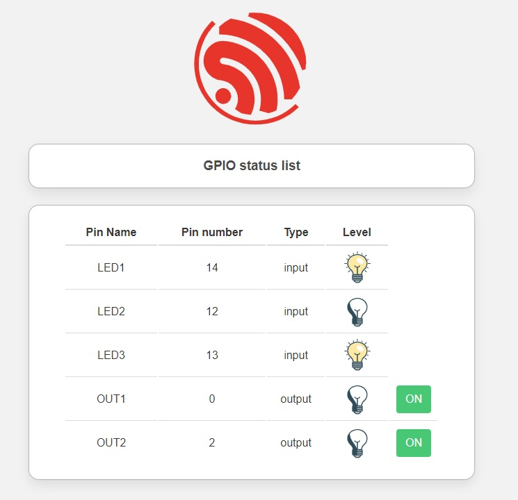

## Introduzione

Uno tra gli argomenti più “caldi” nel mondo Arduino & co. è come far fare alla nostra board qualcosa in risposta ad un comando impartito da remoto, come ad esempio attraverso una pagina web o una _“single page application”_.
La rete è piena di tutorial e video tutorial su questo argomento, ma spesso sono solo un copia e incolla perpetuo di altri tutorial fatti a partire dagli esempi inclusi nelle librerie o poco più (dove giustamente vengono illustrate solo le funzionalità “di base”).

La maggior parte delle volte viene usata una variabile String con tutto il codice HTML concatenato e generato a runtime: leggibilità del codice inesistente, manutenibilità non pervenuta, scalabilità nemmeno a parlarne, ergonomia cognitiva della pagina lasciamo perdere…

Ho deciso quindi di aggiungere il “metodo” che ho deciso di adottare personalmente in questo mare magnum, usando un approccio che consente di ottenere firmware più efficienti con pagine realmente dinamiche ed esteticamente gradevoli allo stesso tempo.
Inoltre, il contenuto delle pagine web potrà essere zippato e memorizzato direttamente in flash, se il microcontrollore ne ha a sufficienza, oppure salvato su una memoria esterna come ad esempio una SD*.

Anche se inizialmente può sembrare più laborioso e complesso, vi assicuro che una volta acquisite le (poche) competenze di base, sviluppare un'interfaccia web sarà poi semplice, veloce e divertente!

*_In realtà la pagina web generata le possiamo mettere dove preferiamo.
Ci sono molti servizi completamente gratuiti che consentono di caricare delle webpage “statiche”, anche lo stesso Github ad esempio. Sfruttando dei servizi “serverless” che fanno da ponte, si potrebbe raggiungere il nostro microcontrollore da ovunque volendo.
Il principio è più o meno quello di Blynk, ma ovviamente in questo caso abbiamo noi il pieno controllo di cosa e come fare. Ad esempio io l'ho fatto sfruttando Google Firebase [esp-vue-gui-firebase](https://github.com/cotestatnt/esp-vue-gui-firebase)_

## Installazione e configurazione dei tool di sviluppo

Lo sviluppo della nostra applicazione sarà articolata in due fasi distinte:
- sviluppo del firmware del microcontrollore.
- sviluppo dell’interfaccia grafica aka pagina/e web che sarà “servita” al client;

La prima parte la sorvoliamo per ora perchè è la più semplice: in pratica il nostro microcontrollore non dovrà far altro che recuperare dalla memoria flash un array di byte che rappresenta il contenuto della pagina zippato (tutti i browser supportano in modo nativo pagine HTML compresse in formato gzip), oppure i file che compongono il nostro web server da una memoria esterna.

Gli strumenti che andremo ad utilizzare sono essenzialmente 3.
- **Visual Studio code**
- **Node.js**
- **Vue.js**

Come prima cosa, se non è già installato nel vostro PC, dovrete installare Visual Studio Code. Una volta finita l’installazione, aprite la tab “estensioni” ed aggiungete _PlatformIO_ e _Vetur_.

Installate quindi il [runtime node.js](https://nodejs.org/). L’installer di node, aggiungerà anche l’indispensabile **npm** (dovrebbe essere node-packet-manager) che ci consentirà poi di aggiungere tutti i moduli necessari al nostro progetto compreso il framework Vue.

Ora siamo pronti per iniziare!

Aprite quindi un terminale e installate il modulo node.js **Vue** ma accessibile a livello globale; i moduli infatti di default vengono salvati nel progetto all'interno della cartella **node_modules**.
	
	npm install vue --global

Create una cartella che andrà a contenere il sorgente dei progetti (se lo ritenete utile) e posizionatevi all’interno di essa.

	mkdir vue-projects

	cd vue-projects

Nota: se il sistema non dovesse riconoscere il comando **npm** significa che non è stato impostato automaticamente il PATH dell’eseguibile come variabile di sistema, quindi controllate se è un’opzione dell’installer o se è necessario farlo manualmente.

Con il seguente comando verrà inizializzato e creato un progetto vue (all'interno della cartella passata come parametro)

	vue create demo-gui

Si avvierà una specie di procedura guidata al termine della quale avremo il nostro primo progetto di prova funzionante (con una pagina demo installata automaticamente dal framework). Lasciate il preset proposto di default per iniziare.

Provate ad avviare il progetto seguendo le indicazioni a schermo ed aprite l’indirizzo proposto nel vostro browser. Avete appena sviluppato la vostra prima Single Application Page con Vue!!!
Scherzi a parte, adesso avete un template da usare come base di partenza per poter quindi aggiungere tutto il necessario.

Se da linea di comando digitate

	code .
	
si avvierà VSCode caricando la cartella corrente come progetto (e riconoscendo in modo automatico che è un progetto Vue grazie al plugin Vetur) all’interno del quale potremo vedere tutti i file generati prima. Chiudete pure il terminale, ora quando sarà necessario si può usare quello incluso in VSCode (Terminal -> New Terminal).. anche se in realtà potevamo farlo prima :)

## Struttura del progetto Vue

Facciamo una rapida rassegna dei file che sono stati generati.
Tutto ciò che riguarda la compilazione del progetto sarà descritto nel file _package.json_, dipendenze, script da eseguire, regole di compilazione etc etc. 

I sorgenti della pagina invece sono nella cartella **/src** e come potete vedere sono organizzati per “componenti” all’interno di sottocartelle. Nella cartella **/public** invece ci sono dei componenti statici che verranno inclusi in fase di compilazione.

Andremo poi ad aggiungere anche qualche altro file per “istruire” il software e fare in modo di generare in modo automatico un file **“webpage.h”** dove sarà definito il famoso array di byte da usare per compilare il firmware della MCU. In questo semplice progetto useremo solo un paio di componenti e quindi per ciascuno di loro andremo a creare il corrispondente file **.vue**

Prima di mettere mani al codice vero e proprio aggiungete anche questi due file nella cartella principale [finalize.js](https://github.com/cotestatnt/vue-esp-gui/blob/main/demo-gui/finalize.js) e [vue.config.js](https://github.com/cotestatnt/vue-esp-gui/blob/main/demo-gui/vue.config.js)
Aggiungete quindi alle dipendenze del progetto i seguenti moduli node.js che saranno necessari per la coretta compilazione.

	npm install --save webpack-shell-plugin @gfx/zopfli gzip axios

A questo punto se provate ad eseguire il comando.

	npm run build

sarà creata una cartella dist che contiene tutti i file HTML, Javascript e CSS necessari per il webserver ed il nostro agognato file _webpage.h _da importare.
Con `npm run serve` invece si può avviare dopo aver compilato il webserver temporaneo per il debug.

Usando il file finalize.js proposto, _webpage.h_ verrà creato nella cartella principale, ma potete modificare il percorso come volete.

Ad esempio, io di solito faccio in questo modo
- nome_progetto
  - sorgente_micro 
  - sorgente_gui

usando il percorso relativo nel file finalize.js **_'../sorgente_micro/webpage.h'_**  il file compilato e aggiornato verrà automaticamente sovrascritto così evito di fare copia e incolla.

### Nota
**Se fate il download del progetto di prova completo**, invece di aggiungere ogni singolo modulo manualmente, posizionatevi all'interno della cartella del progetto Vue **demo-gui** e con il comando _**npm install**_ verranno installati tutti i moduli necessari (definiti in _package.json_)

## Sviluppo

E’ giunto il momento di iniziare a mettere mani al sorgente Vue.
Vue, è abbastanza semplice da usare. Ha una curva di apprendimento molto facile e ci sono centinaia di esempi già pronti all’uso (una risorsa eccezionale sul web, non solo per Vue, è [codesandbox](https://codesandbox.io/)), ma ovviamente se non si conosce per niente un sistema di sviluppo un minimo ci si dovrà documentare.
Io ad esempio ho seguito queste [videolezioni](https://www.youtube.com/watch?v=MdvBAgAeIZQ&list=PL0qAPtx8YtJdUH44fvkzVxy9waP23I_bE) che spiegano in modo chiaro come muovere i primi passi, anche se i riferimenti sono un po’ datati e qualcosa potrebbe non tornare con la versione attuale di Vue.

Acquisito un minimo di conoscenze di base, iniziamo con il nostro progetto di prova definendo i requisiti funzionali della nostra webpage. Come MCU useremo un ESP8266, perché molto diffuso e pratico con il WiFi integrato, ma ovviamente si può estendere a qualsiasi microcontrollore.

Visualizzeremo la classica pagina che mostra lo stato dei GPIO selezionati nello sketch.
- Se il GPIO è configurato come uscita, ci sarà un “led” di stato e un pulsante per attivare/disattivare l’uscita.
- Se il GPIO è un ingresso invece ci sarà solo un “led” acceso/spento in funzione del livello del segnale.
- La pagina dovrà essere dinamica, ovvero aggiornarsi automaticamente in modo asincrono e senza refresh “imposti”.
- Dovrà avere un aspetto estetico “gradevole”. 
- Dovrà essere completamente accessibile anche senza connessione Internet.
- In qualsiasi momento, potrò ridefinire ingressi e uscite nel firmware della MCU e la pagina dovrà adeguarsi in automatico senza necessità di  modificare il codice lato GUI
 
Ci sono molti framework di stile CSS disponibili, in questo esempio userò [Bulma](https://bulma.io) perché leggero, molto accattivante graficamente e soprattutto modulare.
Voglio infatti che le dimensioni del file webpage.h siano il più contenute possibile e quindi andrò ad utilizzare i singoli moduli CSS importando solo quello che viene realmente usato e non tutto il pacchetto completo.

Create quindi una cartella **style** all’interno di **src** e in questa cartella aggiungete il file **_bulma.scss_** dove saranno definiti quali moduli CSS importare in funzione delle esigenze.

Ovviamente è necessario aggiungere al progetto anche i moduli node.js necessari nel solito modo (occhio alle versioni di sass-loader e webpack altrimenti non compila correttamente)

	npm install --save webpack@4 sass-loader@10 sass bulma 

Come detto la nostra interfaccia grafica dovrà essere dinamica ovvero aggiornarsi in tempo reale senza l’interazione dell’utente. In questo esempio però ci sono due scenari diversi:
- L’utente esegue un’azione sulla pagina e la MCU deve reagire di conseguenza
- Lo stato degli ingressi/uscite della MCU variano in funzione del firmware ed è necessario dare feedback alla pagina.
	
Il primo scenario è il più semplice, basterebbe fare una chiamata al server con gli opportuni parametri il quale reagirà di conseguenza.
Il secondo caso invece non è così banale perché le connessioni browser/server sono tipicamente mono-direzionali: il browser chiede una pagina al server, questo la prepara, la invia, il browser chiude la connessione, fine.

Il metodo che si vede più comunemente in giro è fare l’odioso refresh della pagina; rozzo, antiquato e **decisamente non “reactive”!**

Una seconda opzione è far eseguire delle chiamate asincrone AJAX al browser in background e aggiornare dinamicamente gli elementi della pagina con qualche riga Javascript. 
Molto molto meglio, ma rimane comunque la necessità di fare il “polling” di continuo al server per richiedere i dati aggiornati a causa del meccanismo browser/server di cui prima.

Noi però vogliamo che il funzionamento sia completamente asincrono e bidirezionale; ecco che ci viene quindi in aiuto **WebSocket**, largamente supportato dal 99% dei browser moderni (certo se usate ancora Netscape Navigator non funzionerà …).

_WebSocket è una tecnologia web che fornisce canali di comunicazione full-duplex attraverso una singola connessione TCP (wikipedia)_

Useremo quindi questo canale WebSocket per “veicolare” tutte le informazioni necessarie per renderizzare correttamente la pagina in risposta a quello che accade fisicamente lato microcontrollore. Visto che il canale è full-duplex, approfittiamo e lo usiamo anche nell'altra direzione per inviare i comandi alla MCU (ovvero l'unico implementato cioè quello di attivazione delle uscite).

WebSocket è nativamente supportato da Javascript e conseguentemente da Vue. Non ci sarebbe necessità di installare moduli aggiuntivi. Noi però andremo comunque ad installare vue-native-websocket che semplifica un po’ la gestione del sorgente Vue oltre ad avere delle funzionalità di base già implementate (auto-reconnect, formattazione dei dati etc etc).

Le informazioni scambiate tra microcontrollore e browser saranno formattate secondo lo standard **JSON**, anch’esso nativamente supportato da Javascript mentre lato microcontrollore vi consiglio di installare l’ottima libreria [ArduinoJson](https://github.com/bblanchon/ArduinoJson)

Per quanto riguarda il server WebSocket ho invece usato questa libreria [Links2004/arduinoWebSockets](https://github.com/Links2004/arduinoWebSockets)

